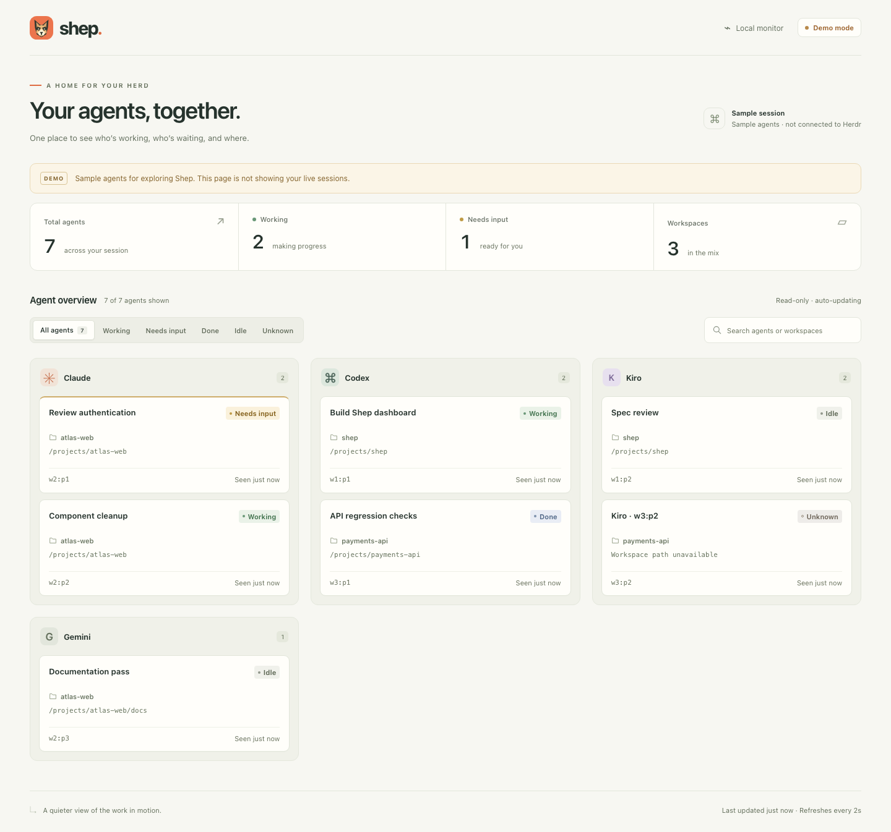
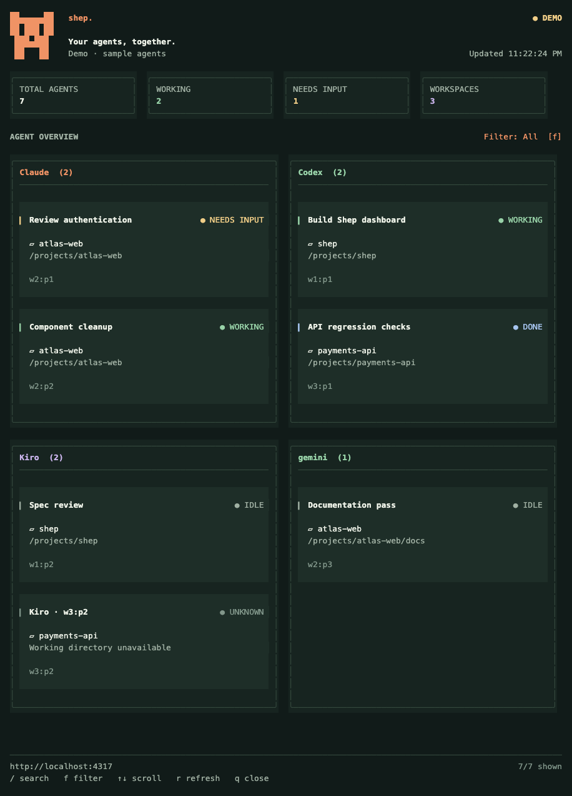

<p align="center">
  
</p>

<h1 align="center">Shep</h1>
<p align="center"><strong>Your agents, together.</strong></p>

Shep is a local dashboard for the coding agents you run inside [Herdr](https://herdr.dev/). Type `shep` in a Herdr pane to see Claude, Codex, Kiro, and other agent types in one place, grouped by name, with their status, workspace, and working directory.

Keep it beside your chat in a terminal pane, or open its browser companion at **http://localhost:4317**. Both views show the same data from your current Herdr instance.



*Preview uses clearly labeled sample agents. Shep reads live status from Herdr when you run it normally.*

## What Shep does

- Groups agents by provider, including Claude, Codex, Kiro, and additional types reported by Herdr.
- Shows which agents are working, waiting for input, done, idle, or unknown.
- Displays each agent's workspace and working directory across the current Herdr session.
- Supports search, status filters, and keyboard navigation in the terminal and browser.
- Brings a small pixel-art shepherd dog to the terminal header, with a compact mark in narrow panes.
- Refreshes about every two seconds and marks retained data as stale if the connection drops.
- Runs locally with no runtime npm dependencies, API keys, accounts, or cloud services of its own.

Shep is a read-only monitor. It does not send prompts, stop agents, or read conversation transcripts. Herdr supplies the agent list and status; Shep does not infer activity by scanning operating-system processes.

## Requirements

| Requirement | Details |
| --- | --- |
| Herdr | Version 0.9.1 or newer, with a running session |
| Node.js | Version 22 or newer, with `node` and `npm` on your PATH |
| Operating system | macOS or Linux |
| Git | Needed to clone this repository |

Current verification was performed on macOS with Node.js 26.7.0 and Herdr 0.9.1. Linux and the Node.js 22 minimum are support targets that have not yet been verified on those runtimes.

**Run Shep inside a Herdr pane.** It can start from any folder in that pane. A regular terminal outside Herdr cannot start the dashboard; `shep --help` and `shep --version` work anywhere.

## Installation

### 1. Get the source

```sh
git clone https://github.com/andrizzit/shep.git
cd shep
```

### 2. Build and install the local package

```sh
npm pack
npm install --global --prefix "$HOME/.local" ./shep-herdr-plugin-0.2.1.tgz --offline --ignore-scripts --no-audit --no-fund
```

This installs the `shep` and `shep-run` commands into `$HOME/.local/bin`, and copies the app and browser assets into `$HOME/.local/lib/node_modules/shep-herdr-plugin`. The package's internal name is `shep-herdr-plugin`; the app and command are **Shep** and **`shep`**.

The installation is local and needs no dependency downloads. It installs a copy, so you can run Shep without keeping the source checkout in its original location. No npm registry release is published; use the package built from this repository.

### 3. Make the commands available

If `$HOME/.local/bin` is not already on your PATH, run:

```sh
export PATH="$HOME/.local/bin:$PATH"
```

Add that same line to your shell configuration to keep it for future terminals: `~/.zshrc` for zsh or `~/.bashrc` for bash. Verify the installation:

```sh
shep --version
```

## Run, close, and reopen

In any Herdr pane, from any folder:

```sh
shep
```

`shep-run` is an equivalent command. Shep stays in the pane where you launch it, so run it in the pane on the right of your chat for a side-by-side view. It automatically connects to **that pane's current Herdr instance** and shows agents across all its workspaces.

While Shep is running, open [localhost:4317](http://localhost:4317) for the browser dashboard. Quitting Shep also stops that browser server.

- **Close:** press `q` outside search, or press `Ctrl+C` at any time.
- **Reopen:** run `shep` again in the pane.
- **Agents:** continue running when Shep closes.



*Terminal preview rendered from Shep's ANSI output with sample data. Colors and emoji appearance depend on your terminal.*

### Command options

| Command | Behavior |
| --- | --- |
| `shep` | Terminal board and browser companion |
| `shep-run` | Alias for `shep` |
| `shep --web` | Browser companion only; keep this process running in Herdr |
| `shep --port 4319` | Use a different localhost port |
| `shep --demo --port 4318` | Show clearly labeled sample agents inside Herdr |
| `shep --help` | Show command help |
| `shep --version` | Show the installed version |

`SHEP_PORT` sets the default port; `--port` overrides it. `NO_COLOR=1 shep` disables terminal colors. `--terminal` explicitly selects the default terminal view.

### Terminal controls

| Key | Action |
| --- | --- |
| `/` | Search agent names and workspaces |
| `Enter` | Keep the search and leave the search editor |
| `Esc` | Clear the search and leave editing; outside editing, also reset the status filter |
| `f` | Cycle status filters |
| `1`–`6` | Select All, Working, Needs input, Done, Idle, or Unknown |
| `↑` / `↓` or `k` / `j` | Scroll |
| `Page Up` / `Page Down` / `Space` | Scroll up or down by ten rows |
| `Home` / `End` | Jump to the top or bottom |
| `r` | Refresh immediately |
| `q` | Quit outside search editing |
| `Ctrl+C` | Quit, including while editing a search |

## What the statuses mean

| Status | Meaning |
| --- | --- |
| Working | Herdr reports active work |
| Needs input | Herdr reports `blocked`, such as an input or permission prompt |
| Done | Herdr reports completion not yet marked seen |
| Idle | Herdr reports an idle agent |
| Unknown | Herdr cannot determine the status, or returns an unfamiliar value |

Status accuracy follows Herdr's detectors. Shep does not mark completed work as seen. If Herdr becomes unavailable after a successful connection, the last snapshot stays visible with a stale warning. A successful empty snapshot clears agents that are no longer present.

The scope is **one current Herdr instance**. Agents in other instances, other terminal applications, remote machines, or internal subagents that Herdr does not expose are not shown. Startup requires the host-provided socket and pane context; there is no manual session selector. `--session` is rejected and `SHEP_SESSION` is ignored.

## Optional Herdr plugin shortcut

You can also register the installed app as a Herdr plugin that opens a new split pane:

```sh
herdr plugin link "$HOME/.local/lib/node_modules/shep-herdr-plugin"
herdr plugin pane open --plugin shep --entrypoint board --direction right --no-focus
```

The new pane is labeled **🐕 Shep**. The plugin and the `shep` command use the same application. Stop an existing Shep instance first, or give the new one another port:

```sh
herdr plugin pane open --plugin shep --entrypoint board --direction right --no-focus --env SHEP_PORT=4319
```

The plugin shortcut is optional. Typing `shep` in an existing pane is enough to use the app.

## Troubleshooting

| Problem | What to do |
| --- | --- |
| `shep: command not found` | Check that `$HOME/.local/bin` is on PATH. Try `$HOME/.local/bin/shep --version`, then open a fresh shell if needed. |
| “Shep runs only inside Herdr” | Open a shell pane inside Herdr and run `shep` there. A regular terminal is not enough, even if Herdr is running elsewhere. |
| Current pane/session is unavailable | Quit and reopen Shep from a current Herdr pane. It checks the pane, tab, workspace, and socket supplied by the host before starting. |
| Port 4317 is already in use | Stop the other Shep instance or run `shep --port 4319`; then visit localhost:4319. |
| No agents found | Start a supported agent inside the same Herdr instance. Empty provider groups are expected until matching agents exist. |
| Connection interrupted / stale data | Check that Herdr is running, then press `r` or use the browser's Retry button. Polling retries automatically. |
| Browser stops responding after quitting | The browser server belongs to the Shep process. Run `shep` again to reopen it. |

## Local data and privacy

Shep reads agent identity, status, pane/workspace metadata, and working directories through `herdr api snapshot`. It keeps snapshots in memory and does not store them on disk. It does not collect credentials or transmit data to a hosted service.

The browser server binds to `127.0.0.1` and serves only the dashboard assets and the snapshot endpoint. Other local processes and users with access to your machine may be able to read this dashboard. Host/Origin checks restrict browser requests; the Herdr environment check is host integration, not authentication against deliberately forged environment variables.

## Update or uninstall

To update, stop Shep, pull the latest source, then repeat the package/install commands from the installation section. Reopen it with `shep`. Source edits do not change an already installed copy. If the plugin manifest changed, repeat the optional `herdr plugin link` command.

To uninstall, first stop Shep. If you registered the optional plugin, remove its registration:

```sh
herdr plugin unlink shep
```

Then remove the installed commands and application:

```sh
npm uninstall --global --prefix "$HOME/.local" shep-herdr-plugin
```

Your agents, Herdr sessions, and source checkout remain intact.

## Development

There are no runtime dependencies to install and no build step:

```sh
npm run check
npm test
```

The tests use Node's built-in test runner, controlled Herdr fixtures, and temporary localhost servers. They cover snapshot normalization, current-instance validation, package installation, terminal controls, stale recovery, and HTTP boundaries. Tests do not need a running Herdr session.

To run from source inside Herdr:

```sh
npm start         # Terminal board and browser companion
npm run demo     # Browser demo at localhost:4318
```

Optional browser checks need a separately installed Playwright with Chromium. An axe module enables the accessibility scan:

```sh
SHEP_PLAYWRIGHT_MODULE=/absolute/path/to/playwright/index.mjs \
SHEP_AXE_MODULE=/absolute/path/to/@axe-core/playwright/dist/index.mjs \
node scripts/verify-ui.mjs
```

The browser runner starts and stops its own controlled test server. Set `SHEP_LIVE_URL=http://localhost:4317` to check an already-running live app instead. `scripts/preview-terminal.mjs` renders the sample terminal preview using the same optional Playwright setup. Browser tooling is not included in the installed app.

| Location | Purpose |
| --- | --- |
| `bin/` | Installed command entrypoint |
| `src/` | CLI, Herdr adapter, polling, terminal UI, and HTTP server |
| `public/` | Browser dashboard and shepherd-dog icon |
| `tests/` | Automated tests and controlled sample fixtures |
| `scripts/` | Syntax and optional visual checks |
| `docs/images/` | Sample dashboard previews |
| `herdr-plugin.toml` | Optional Herdr plugin entrypoint |

## Herdr integration references

- [Plugin interface](https://herdr.dev/docs/plugins/)
- [Socket API](https://herdr.dev/docs/socket-api/)
- [Agent detection](https://herdr.dev/docs/agents/)
- [CLI reference](https://herdr.dev/docs/cli-reference/)
